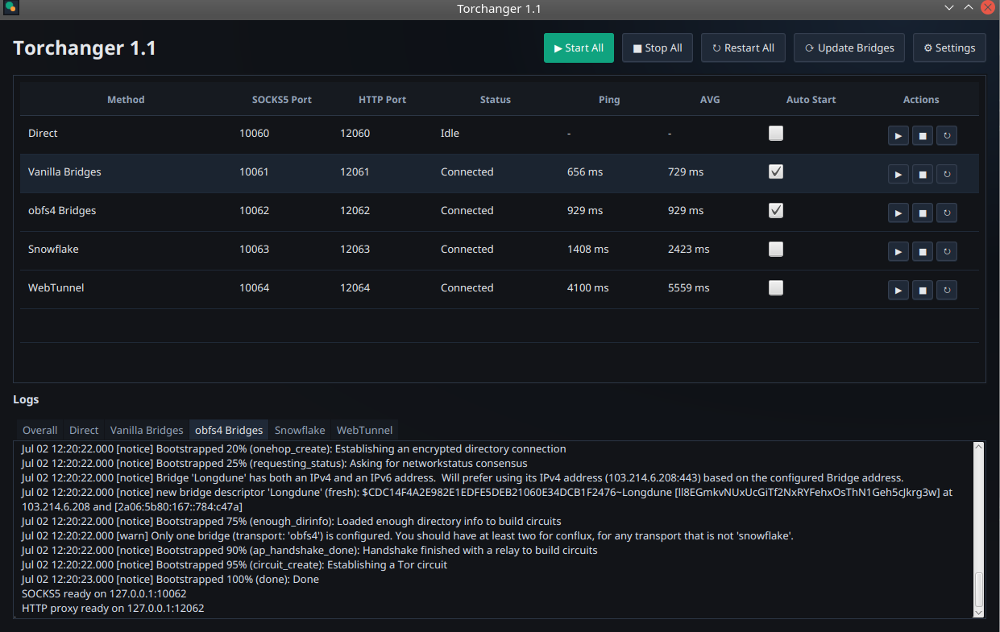
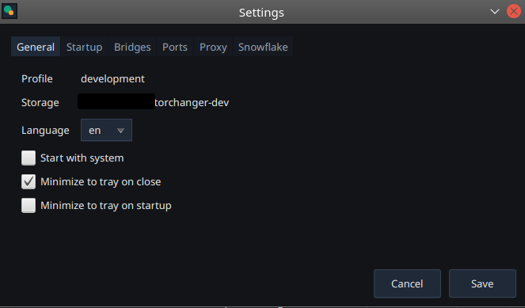

# Torchanger

Torchanger is a desktop application that starts, monitors, and manages multiple Tor connection profiles from a single window.

## Features

- Run several Tor profiles in parallel.
- Start direct Tor, vanilla bridge, obfs4, Snowflake, and WebTunnel profiles.
- Expose local SOCKS5 and HTTP proxy endpoints for each profile.
- Monitor status, connection progress, ping, and average latency.
- Review separate logs for every profile.
- Minimize to tray and restore active sessions quickly.

## Screenshots

### Main Window

### Compact View

## Runtime Dependencies

Torchanger does not bundle the Tor network tools themselves. Install these on the target Ubuntu system:

- `tor`
- `curl`
- `obfs4proxy`
- `snowflake-client`
- `lyrebird`

## License

This project is released under the [Unlicense](UNLICENSE).
